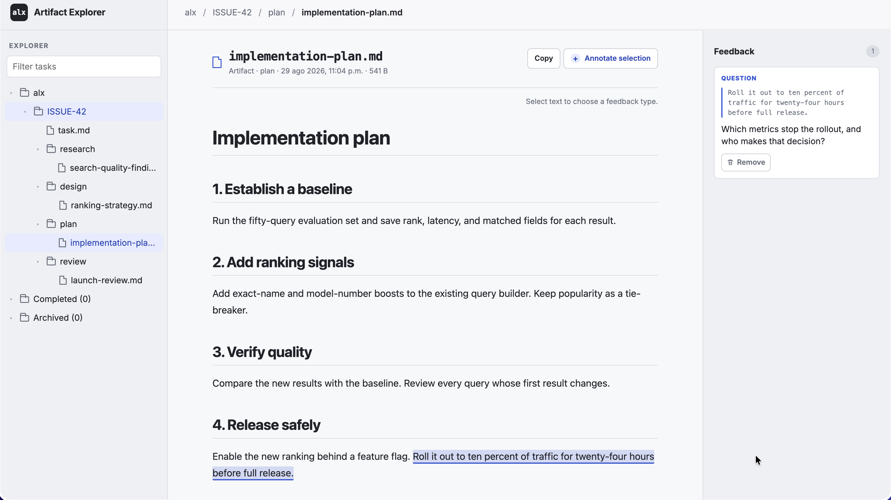

# alx

`alx` is a local workspace for durable human↔agent task state.

Use it to keep task statements, research, designs, plans, review notes, and
inline feedback outside agent sessions and outside your repository.

Agents can read and update it through the CLI. Humans can prepare and review
the same artifacts through the web UI.

Git remains the source of truth for code. `alx` keeps the current workflow
state around the code.



*One workspace for task context, working artifacts, and human feedback.*

## Keep work available between sessions

Agent sessions are temporary. The work around a task often is not.

A research note can inform a design. A design can become a plan. A human can
comment on an exact part of that plan. The next agent session can read the task,
its artifacts, and the unresolved feedback without reconstructing the work from
chat history.

`alx` stores that state locally in SQLite. The CLI and web UI use the same
storage layer, so there is no handoff format to maintain and no hosted account
to create.

## A shared review loop

Create a task with an ID from the system you already use:

```bash
alx task create ISSUE-42 <<'EOF'
Improve search result relevance without increasing query latency.
EOF
```

An agent can store research, designs, plans, or any other artifact type:

```bash
PLAN_ID=$(alx artifact create ISSUE-42 plan \
  --name implementation-plan.md < implementation-plan.md)
```

Open the plan for review:

```bash
alx artifact review "$PLAN_ID" --interactive
```

The human selects text and adds comments, questions, scratch notes, or positive
feedback in the browser. When the review finishes, the unresolved feedback is
returned to the agent through the CLI. The agent can revise the artifact and
resolve each annotation without losing the task context.

A later session can recover the task statement and all artifacts with one
command:

```bash
alx task context ISSUE-42
```

The context includes each artifact UUID, which the agent can use to read its
unresolved review feedback.

Search across task bodies, artifacts, and annotation text with regular
expressions:

```bash
alx grep 'latency|relevance'
```

Artifact matches include the artifact UUID, which can be inspected directly
with `alx artifact info ARTIFACT_UUID`.

## A clear boundary around code

Use Git for code and versioned project documents. Use `alx` for the live state
of the work around them:

- canonical task statements
- research and investigation results
- designs and implementation plans
- review notes and inline feedback
- active, completed, and archived task state

Artifacts can have any type and filename. Task IDs can match an issue tracker,
a support ticket, or any naming system you already use.

## Local by default

`alx` does not require a hosted service. It stores its database in the platform
application-data directory, or at the path set by `ALX_DB`.

The web UI listens on `127.0.0.1:3000` by default. Non-loopback and Tailscale
serving require a password. An optional native user service can keep the UI
available after login or reboot.

Tasks and artifacts can be exported to a readable directory or zip archive:

```bash
alx dump ./export
alx dump --zip ./export.zip
```

Annotations remain in the SQLite database and are not included in exports.

## Install

```bash
cargo install alx-fs
```

Install the embedded agent skill if your agent supports the common skill
format:

```bash
alx skill install
```

Start the web UI when you want to prepare or review work:

```bash
alx serve
```

## Built for CLI workflows

Successful data goes to stdout. Errors, review URLs, and server status go to
stderr. Interactive `grep` output uses colors and grouped paths; piped output is
stable and uncolored. Commands intended for scripting support JSON where
structured output is useful.

This makes commands easy to compose with shells, editors, and agents:

```bash
alx artifact read "$PLAN_ID" | glow
alx artifact review "$PLAN_ID" | pbcopy
alx task context ISSUE-42 | nvim -
```

## Documentation

See the [complete reference](docs/reference.md) for task and artifact commands,
annotations, exports, service management, authentication, storage paths, and
exact output formats.

The CLI also provides command-specific help:

```bash
alx help
alx artifact --help
alx serve --help
```
